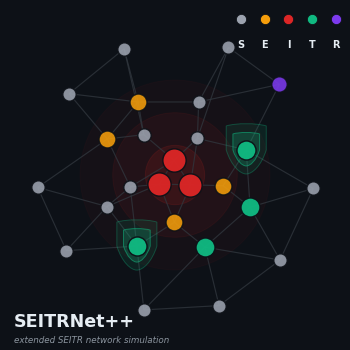

<div align="center">

<picture>
  <source media="(prefers-color-scheme: dark)" srcset="assets/hero_seitrnet_pp_350.png">
  
</picture>

# SEITRNet++

### Network-Aware Optimal Control of SEITR Epidemics

_How Contact Network Topology Reshapes Intervention Strategies_

[](https://www.r-project.org/)
[]()
[]()
[]()
[]()

</div>

---

## Overview

This repository contains the analysis pipeline for SEITRNet++ on dynamics, control, and network structure. The central scientific question is whether the optimal treatment policy derived from the standard well-mixed ODE — the textbook intervention — remains effective when disease spreads through structured contact networks with heterogeneous degree distributions, clustering, and community structure.

We deploy a **stochastic SEITR (Susceptible–Exposed–Infected–Treated–Recovered) agent-based model** on three canonical network families — Erdős–Rényi, Barabási–Albert, and Watts–Strogatz — and use **L-BFGS-B multi-start optimization** on the simulation objective to find network-aware treatment policies.

Updating the [SEITRNet](https://github.com/skaraoglu/SEITRNet); the simulation kernel has been **rewritten from scratch in C++** (via Rcpp) for a speedup over the [SEITRNet](https://github.com/skaraoglu/SEITRNet) pure-R codebase, enabling a 69-experiment parameter sweep that completes in under 5 hours.


---

## The Model

### SEITR Compartmental Dynamics

$$\dot{S} = \Lambda - \frac{\beta_1 S I}{N} - \mu S$$

$$\dot{E} = \frac{\beta_1 S I}{N} - (\beta_2 + \mu) E$$

$$\dot{I} = \beta_2 E - (\beta_3 + \mu + \delta_I + u(t)) I$$

$$\dot{T} = u(t) \cdot I - (\mu + \delta_T + \alpha_2) T$$

$$\dot{R} = \beta_3 I + \alpha_2 T - \mu R$$

where $u(t) \in [0, \zeta]$ is the time-varying treatment control applied at each discrete timestep to every infected node.

### Optimal Control Objective

$$\min_{u} J(u) = \int_0^{T_f} \Big[ E(t) + I(t) + w_1 \cdot u(t)^2 \Big] dt \qquad \text{s.t.} 0 \le u(t) \le \zeta$$

The integrand balances epidemiological burden ($E + I$) against quadratic control cost. The ODE-optimal solution is obtained via **Pontryagin's Maximum Principle** (forward–backward sweep with RK4 midpoint integration); the network-optimal solution is obtained via **L-BFGS-B** on stochastic simulation averages with common random numbers.

| Parameter | Value | Meaning |
|-----------|-------|---------|
| $\Lambda$ | 0.4 | Recruitment rate |
| $\beta_1$ | 0.9 | Transmission rate ($S \to E$) |
| $\beta_2$ | 0.059 | Progression rate ($E \to I$) |
| $\beta_3$ | 0.2 | Recovery rate ($I \to R$) |
| $\alpha_2$ | 0.055 | Treatment recovery ($T \to R$) |
| $\delta_I, \delta_T$ | 0.03 | Disease-induced death rates |
| $\mu$ | 0.02 | Natural death rate |
| $w_1$ | 0.2 | Control cost weight |
| $\zeta$ | 1.0 | Control upper bound |
| $R_0$ | 2.4005 | Basic reproduction number |

---

## Experiment Design

<table>
<tr>
<td width="50%">

**Experiment 1 — Cross-Topology Comparison** (45 runs)
- $p \in \{0.2, 0.5, 0.9\}$ (anchor connectivity)
- ER (3) + BA (3) + WS (9) = 15 network configs
- $K \in \{5, 20, 100\}$ control segments
- $n = 100$ nodes, 20 replicates per evaluation

**Experiment 2 — Structural Metrics** (post-hoc)
- $C$, $L$, $\sigma$, $Q$, degree distribution moments
- Rank correlation with control performance gap

</td>
<td width="50%">

**Experiment 3 — Network Size Scaling** (24 runs)
- $n \in \{50, 100, 200, 500\}$
- ER, BA, WS at $p = 0.5$ (medium connectivity)
- $K \in \{5, 20\}$
- Per-size ODE reference solutions (corrected analysis)

**Experiment 4 — Control Profile Shape** (post-hoc)
- 69 optimized $u_1(t)$ profiles analyzed
- Total effort, peak, front-loading index
- ODE correlation, temporal variability (CV)

</td>
</tr>
</table>

### Parameter Derivation ([SEITRNet](https://github.com/skaraoglu/SEITRNet) Convention)

All network parameters are **anchored to the ER connectivity probability** $p$, ensuring that cross-topology differences are attributable to structural properties rather than connectivity level:

| Topology | Parameter | Formula | Rationale |
|----------|-----------|---------|-----------|
| **ER** | $p$ | anchor | Baseline homogeneous random mixing |
| **BA** | $m = \lfloor n \cdot p \rceil$ | Matches ER expected edge count |
| **WS** | $p_{\text{rewire}} = p$ | Rewiring probability matches ER |
| | $k \in \{\lfloor 0.05n\rceil, \lfloor 0.10n\rceil, \lfloor 0.20n\rceil\}$ | Local connectivity sweep, scales with $n$ |

---

## Pipeline Architecture

```
┌──────────────────────────────────────────────────────────────────────────┐
│                            diagnosis.ipynb                               │
│  22 test sections  ·  135 assertions  ·  validates every method pre-run  │
└────────────────────────────────┬─────────────────────────────────────────┘
                                 │ all passed
                                 ▼
┌──────────────────────────────────────────────────────────────────────────┐
│                          main_analysis.ipynb                             │
│                                                                          │
│  ┌─────────────┐    ┌─────────────────────┐    ┌────────────────────┐    │
│  │ ODE Solver  │    │  Experiment 1       │    │  Experiment 3      │    │
│  │ FBSM (RK4)  │──▸ │  45 cross-topology  │    │  24 size-scaling   │    │
│  │ 12 itr, 8s  │    │  optimizations      │    │  n = 50 – 500      │    │
│  └──────┬──────┘    └──────────┬──────────┘    └──────────┬─────────┘    │
│         │                      │                          │              │
│         │ warm-start           │ results                  │              │
│         ▼                      ▼                          ▼              │
│  ┌──────────────────────────────────────────────────────────────────┐    │
│  │  Experiment 2 — Topology metrics (C, L, σ, Q)                    │    │
│  │  Experiment 4 — Control shape descriptors                        │    │
│  └──────────────────────────────────────────────────────────────────┘    │
│         │                                                                │
│         ▼                                                                │
│  ┌──────────────────────────────────────────────────────────────────┐    │
│  │  results  ·  CSV summaries  ·  RDS archives  ·  session log      │    │
│  └──────────────────────────────────────────────────────────────────┘    │
└──────────────────────────────────────────────────────────────────────────┘
                                 │
                                 ▼
┌──────────────────────────────────────────────────────────────────────────┐
│                         supplement.ipynb                                 │
│  Extended methods  ·  Result interpretations  ·  Report-ready figures    │
└──────────────────────────────────────────────────────────────────────────┘
```

---

## Key Technical Features

**Compiled C++ simulation kernel** — The SEITR agent-based model (697 lines of C++) processes all status transitions, demographic events, and topology-preserving edge addition in compiled code via Rcpp. A flat `int[max_n × max_n]` adjacency matrix provides O(1) edge queries with perfect cache locality. Dead nodes are soft-deleted (flagged, not removed) and their slots recycled for births, eliminating the O(V+E) `igraph::delete_vertices()` reindexing that dominated runtime in the [SEITRNet](https://github.com/skaraoglu/SEITRNet) codebase.

**[SEITRNet](https://github.com/skaraoglu/SEITRNet)–consistent network generators** — ER uses fixed-count node sampling (not independent Bernoulli); BA uses mean-degree preferential attachment where `mean_degree` divides by `n_alive + 1` (matching R's `mean(degree(g))`); WS uses BFS nearest-neighbor search with stochastic rewiring. These generators are applied both at initialization and during demographic edge addition, preserving topology-specific structural properties across the full simulation horizon.

**Forward–backward sweep ODE solver** — Verbatim transliteration of the [SEITRNet](https://github.com/skaraoglu/SEITRNet) MATLAB-style FBSM with RK4 midpoint integration, 0.5-averaging control update for stability, and Simpson's-rule objective evaluation. Converges in exactly 12 iterations to $J_{\text{ODE}} = 563.314$ — matching the published SEITRNet+OptCont result to four decimal places.

**Two-stage multi-start optimization** — Stage 1 (5 replicates, `factr=1e8`, `maxit=500`) explores the objective landscape across 10 initial guesses; Stage 2 (20 replicates, `factr=1e7`, `maxit=1000`) refines the best candidate. The first guess is derived from the ODE optimal control (warm-start), biasing one start toward the mean-field basin.

**Common random numbers** — L'Ecuyer-CMRG parallel streams (`clusterSetRNGStream(cl, 12345)`) ensure fair comparison across different control profiles during optimization. Forward validation uses independent fresh seeds.

**Network topology metrics** — Clustering coefficient $C$, mean path length $L$, small-world index $\sigma = (C/C_{\text{rand}})/(L/L_{\text{rand}})$, and Louvain modularity $Q$ are computed.

**Diagnosis pipeline** — A dedicated validation notebook (22 test sections, 135 assertions) exercises every component — C++ compilation, kernel output structure per topology, demographic consistency ($N = S+E+I+T+R$), control application mechanics, ODE solver convergence, Simpson's rule exactness, segment expansion, network metric ranges, parallel cluster lifecycle, file I/O roundtrips, plotting functions, size scaling, and edge cases (sparse/dense networks, K=1, K=$T$) — before any experiment begins.

---

## Improvements over [SEITRNet](https://github.com/skaraoglu/SEITRNet) Codebase

The [SEITRNet](https://github.com/skaraoglu/SEITRNet) codebase (pure R, igraph-based) required approximately 1 hour per optimization run at $n = 100$. The refactored SEITRNet++ codebase completes the same run in few minutes.

| # | Improvement | [SEITRNet](https://github.com/skaraoglu/SEITRNet) (before) | SEITRNet++ (after) | Impact |
|---|-------------|--------------------|--------------------|--------|
| 1 | **C++ simulation kernel** | Pure R inner loop with ~200K igraph calls per simulation | Compiled C++ via Rcpp; all transitions in native code | 50–200× wall-clock speedup |
| 2 | **Flat adjacency matrix** | `igraph` graph object; O(V+E) edge queries | `int[max_n × max_n]` flat array; O(1) lookup | Eliminates graph data structure overhead |
| 3 | **Soft deletion** | `igraph::delete_vertices()` reindexes all surviving nodes 3× per timestep | Dead nodes flagged `ST_DEAD`; adjacency rows/cols zeroed; slots recycled for births | Removes O(V+E) per-death reindexing |
| 4 | **In-place compartment counters** | Five `sum(V(g)$status == "X")` sweeps per timestep | Running S/E/I/T/R/N integers updated during transitions | Eliminates 5 × O(N) post-sweep passes |
| 5 | **Batched edge addition** | Per-edge `igraph::add_edges()` calls during births | Edges written directly to `adj[]` in a single pass | O(1) per edge vs O(V+E) per edge |
| 6 | **Topology-preserving edge addition** | Generic `sample()` for all network types | ER: fixed-count uniform; BA: degree-proportional; WS: BFS nearest-neighbor + rewiring | Structural properties preserved during demographic events |
| 7 | **ODE warm-start** | All optimizer starts random (uniform $[0, \zeta]$) | First start from ODE optimal control downsampled to $K$ segments | One start biased toward mean-field basin; reduces median $J$ |
| 8 | **Two-stage optimization** | Single stage with 20 replicates throughout | Stage 1: 5 reps, loose tolerance; Stage 2: 20 reps, tight tolerance | ~60% faster than single-stage equivalent |
| 9 | **Pre-experiment diagnosis** | No validation before committing to long runs | 22-section, 135-assertion validation notebook | Catches bugs before multi-hour experiments |
| 10 | **Network topology metrics** | Metrics computed during simulation but never analyzed | Dedicated `network_metrics.R` | Enables cross-chapter bridge |

---


## Repository Structure

```
├── main_analysis.ipynb           # Main experiment pipeline (R kernel)
├── supplement.ipynb         # Extended methods, results, visualizations
├── diagnosis.ipynb              # Pre-experiment validation (22 tests, 135 assertions)
├── experiment_run.ipynb         # Lightweight standalone experiment runner
├── README.md
│
├── src/
│   ├── seitr_kernel.cpp         # C++ simulation kernel (697 lines)
│   │                            #   ER/BA/WS generators + demographic edge addition
│   │                            #   Flat adjacency matrix, soft deletion, in-place counters
│   │                            #   Sequential node processing (Algorithm 1)
│   ├── ode_control.R            # Forward–backward sweep (Pontryagin's Maximum Principle)
│   ├── experiment.R             # run_experiment(): optimization, forward, no-control modes
│   ├── utils.R                  # Simpson's rule, expand_u1, ODE warm-start extraction
│   ├── plotting.R               # ggplot2 visualization functions
│   └── network_metrics.R        # Topology metrics (C, L, σ, Q)
│
└── results/
    ├── ch3_analysis_log.txt     # Complete timestamped session log
    ├── exp1_summary.csv         # 45 cross-topology results (J_optim, J_forward, J_noctl)
    ├── exp2_topology_metrics.csv # 15 network metric profiles (20-replicate averages)
    ├── exp2_correlations.csv    # Metric–performance rank correlations per K
    ├── exp3_scaling.csv         # 24 size-scaling results (n = 50–500)
    ├── exp4_control_shape.csv   # 69 control profile shape descriptors
    └── rds/                     # Full R objects (trajectories, control profiles)
        ├── ode_solution.rds
        ├── exp1_results.rds
        └── exp3_results.rds
```

---

## Quick Start

```bash
# 1. Clone and ensure R ≥ 4.2 with packages:
#    Rcpp, ggplot2, gridExtra, igraph, parallel, optimParallel, dplyr

# 2. Validate the pipeline (~30 seconds)
jupyter execute diagnosis.ipynb
# → Check diagnosis.log: expect 133 PASS, 0 FAIL, 2 WARN

# 3. Run full experiment suite (~5 hours)
jupyter execute main_analysis.ipynb
# → All results saved to results/

# 4. Generate figures and interpretations
jupyter execute supplement.ipynb
```

---

## Requirements

<table>
<tr>
<td>

**R packages**
```
Rcpp, ggplot2, gridExtra, igraph,
parallel, optimParallel, dplyr, scales
```

</td>
<td>

**System**
```
R ≥ 4.2
C++ compiler (g++ or clang++)
Multi-core CPU recommended (16 cores used)
```

</td>
</tr>
</table>

---

## Citation

If you use this pipeline or build on this work, please cite: Karaoglu, S., Imran, M. & McKinney, B.A. Network-based SEITR epidemiological model with contact heterogeneity: comparison with homogeneous models for random, scale-free and small-world networks. Eur. Phys. J. Plus 140, 551 (2025). https://doi.org/10.1140/epjp/s13360-025-06481-z

---

<div align="center">

*Built on the [SEITRNet](https://github.com/skaraoglu/SEITRNet) compartmental framework · [Pontryagin's Maximum Principle](https://en.wikipedia.org/wiki/Pontryagin%27s_maximum_principle) · [L-BFGS-B](https://en.wikipedia.org/wiki/Limited-memory_BFGS) box-constrained optimization · [Rcpp](https://www.rcpp.org/) compiled simulation kernel*

</div>
